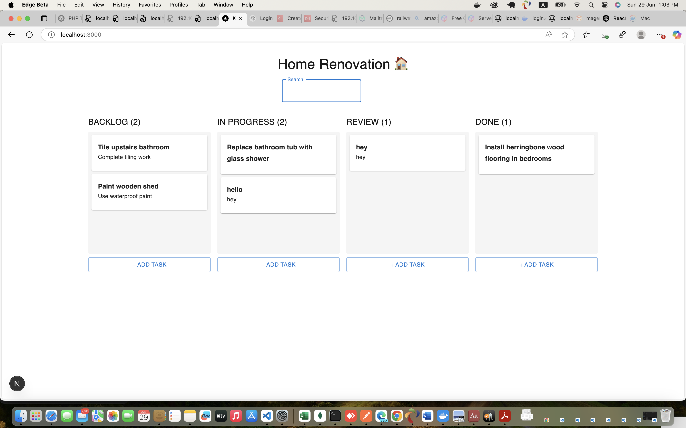
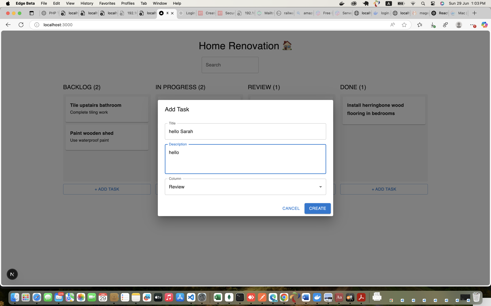
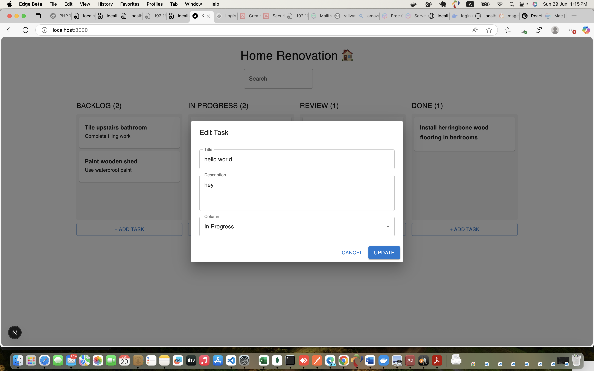

# Kanban ToDo App

A Kanban-style task management app built with Next.js, React Query, Material UI, and json-server.

## Screenshots

  
_The main Kanban board displaying tasks in their respective columns._

  
_Task creation modal allowing users to add task details._

  
_Editing modal allowing users to update task details._

## Features:

- Drag & drop tasks between columns
- Create, update, and delete tasks
- Search tasks by title or description
- Optimistic UI updates with React Query

## Setup Instructions:

1. Install dependencies:
   npm install

2. Start the mock backend (requires json-server):
   npm install -g json-server
   json-server --watch db.json --port 4000

3. Create a `.env.local` file in your project root with:
   NEXT_PUBLIC_API_URL=http://localhost:4000

4. Run the development server:
   npm run dev

Access your app at: http://localhost:3000

## Notes:

- Make sure json-server backend is running for API calls to work.
- Drag and drop updates the UI optimistically.
- If backend is down, UI updates locally but changes won’t persist.
- Columns can be customized in source code under the 'columns' array.

## Folder structure:

/components - React components like TaskCard, TaskColumn  
/pages - Next.js pages (including HomePage)  
/services - API functions (getTasks, updateTask, etc.)  
/public - Static assets
